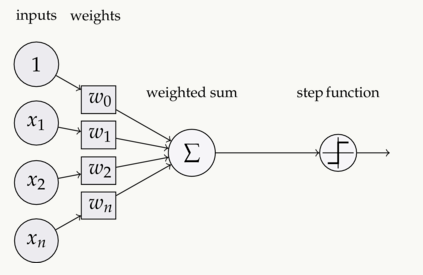

### Keras
##### [Activations](https://keras.io/activations/)
what is activation?:
step function in the following picture.

如果不使用激活函数，这种情况下每一层输出都是上一层输入的线性函数。无论神经网络有多少层，输出都是输入的线性函数，这样就和只有一个隐藏层的效果是一样的。这种情况相当于多层感知机(MLP)。
激活函数的作用可以看作是从原始特征学习出新特征，或者说是将原始特征从低维空间映射到高维空间。
[深度学习中激活函数的优缺点](https://blog.csdn.net/not_guy/article/details/78749509)
[深度学习中激活函数的选择](https://blog.csdn.net/u012151283/article/details/78149243)
##### Available activations
- [softmax](softmax.html)
suppose we have an array $$$ V $$$,and $$$ v_i $$$ represent the ith item.In that way the softmax of this ith item is:
$$
S_i = \frac{e^{v_i}}{\sum_{j=1}^n e^{v_j}}
$$
It is always used as the output layer of NN in multi label classification.
logistic function is a particular case of softmax which is always used in binary classificatin.
- elu(exponential linear unit)
ELU有ReLU的所有优点，并且不会有 Dead  ReLU问题，输出的均值接近0（zero-centered）。但是计算量大，其表现并不一定比ReLU好。
$$
elu(x)=
\begin{equation}
\left\{
\begin{array}{lr}
x, & x\ge 0 \\
\alpha(e^x - 1), &x < 0
\end{array}
\right.
\end{equation}
$$
- selu(Scaled Exponential Linear Unit)
$$
selu(x) = scale * elu(x, \alpha)
$$
- softplus
[神经网络中的激活函数（activation function）-Sigmoid, ReLu, TanHyperbolic(tanh), softmax, softplus](https://blog.csdn.net/qrlhl/article/details/60883604)
softplus可以看作ReLU的平滑版本
$$
softplus(x) = log(e^x + 1)
$$
- softsign
$$
softsign(x) = \frac{x}{\vert x \vert + 1}
$$
- relu
- tanh
$$
tanh(x) = \frac{2}{1 + e^{-2x}} - 1 = \frac{e^x - e^{-x}}{e^x + e^{-x}}
$$
- sigmoid
- hard_sigmoid
&nbsp;&nbsp;faster than standard sigmoid
&nbsp;&nbsp;don't use the more extreme approximations(like the hard sigmoid) when problem is function approximation--errors will reduce slowly, and might plateau before reaching goal.But it's OK for classification.
[What is hard sigmoid in artificial neural networks? ](https://www.quora.com/What-is-hard-sigmoid-in-artificial-neural-networks-Why-is-it-faster-than-standard-sigmoid-Are-there-any-disadvantages-over-the-standard-sigmoid)
$$
max(0, min(1, \frac{x+1}{2}))
$$

- linear

other activations:
*Leaky ReLU*: $$$leakyrelu(x) = max(0.01x, x)$$$, won't die.
*PReLU*: $$$g(z) = max(az, z)$$$, 将a作为学习的参数.
*maxout*: maxout(k)激活函数为当前层的每个节点分别添加k个中间节点，这k个中间节点进行$$$ W_iX + b_i ,i=1,2,...,k$$$运算，最后取max填入当前层对应节点。maxout有很强拟合能力，可拟合任意凸函数。[深度学习笔记--激活函数：sigmoid，maxout](https://blog.csdn.net/Chaolei3/article/details/78873039)
for keras, if no activation function is appointed, a linear function $$$a(x) = x$$$ will be employed.
[keras document](https://keras.io/activations/)