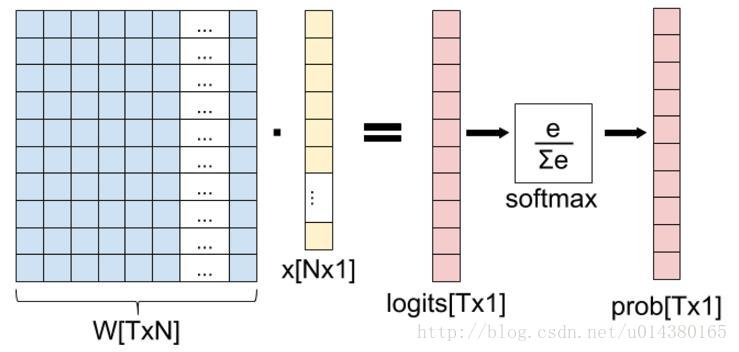

## softmax
-  softmax层输出一个向量属于每个类别的概率，计算公式如下：
$$
S_j=\frac{e^{a_j}}{\sum_{k=1}^Te^{a_k}}
$$
例：
三分类
$$
 \left[
    \begin{matrix}
    w_{11} & w_{12} \\
    w_{21} & w_{22} \\
    w_{31} & w_{33}
    \end{matrix}
 \right]
 \cdot
 \left[
 	\begin{matrix}
    x_1 \\
    x_2
    \end{matrix}
 \right]
 =
 \left[
 	\begin{matrix}
    a_1 \\
    a_2 \\
    a_3
    \end{matrix}
 \right]
$$

- softmax损失函数
$$
L=-\sum_{j=1}^Ty_jlogS_j
$$
$$
Y=
\left[
	\begin{matrix}
    0 \\
    1 (真实标签对应的位置为1)\\
    0
    \end{matrix}
\right]
$$
预测错的越离谱（真实标签的预测概率越小），损失越大。
- cross entropy
$$
E=-\sum_{j=1}^Ty_jlogP_j
$$
跟softmax loss很像，如果softmax输出到cross entropy，则cross entropy的输出即softmax loss。
[参考：卷积神经网络系列之softmax，softmax loss和cross entropy的讲解](https://blog.csdn.net/u014380165/article/details/77284921)